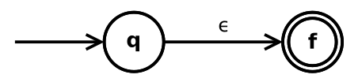
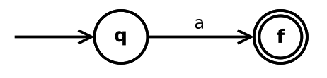
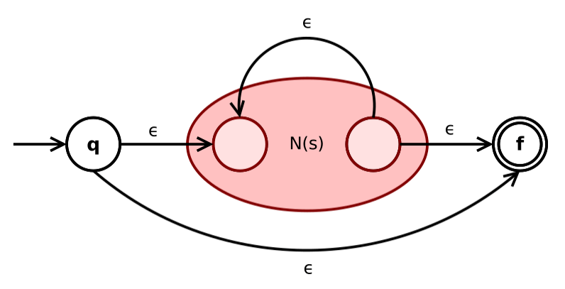
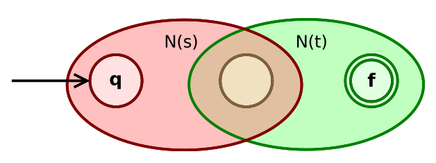
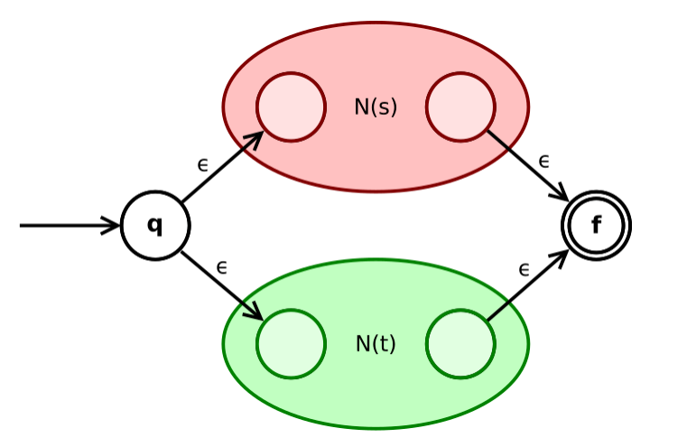

# Conversia expresiilor regulate în automate finite deterministe *(DFA)*

*proiect de Cocu Matei-Iulian*

În această documentație va fi prezentată implementarea conversia unei *expresii regulate* în *automat finit determinist*, urmând ca mai apoi să fie verificată apartenența unui set de cuvinte la *limbajul descris de automatul generat*.

## Conținut
- [1. Conversii](#1-conversii)
  - [1.1. RegEx -> RPN](#11-regex---rpn)
  - [1.2. RPN -> ε-NFA](#12-rpn---ε-nfa)
  - [1.3. ε-NFA -> NFA](#13-ε-nfa---nfa)
  - [1.4. NFA -> DFA](#14-nfa---dfa)
- [2. Verificare](#2-verificare)
- [3. Funcția `main`](#3-funcția-main)
- [4. Referințe](#4-referințe)

## 1. Conversii

### 1.1. RegEx -> RPN

Pentru a ușura transformarea din *expresie regulată* în *automat finit nedeterminist cu ε-mișcări*, aceasta este transpusă în *forma ei postfixată* (cunoscută și sub numele de **Reversed Polish Notation**). Acest algoritm respectă, bineînțeles, principiul precedenței operațiilor: cu cât gradul unei operații este mai mic, aceasta "este calculată la final". Așadar, *reuniunea* (`|`) are gradul cel mai mic, fiind urmată de *concatenare* (`.`), operațiile stelare (`*`), plus (`+`) și opționalitate fiind cele care "sunt calculate cel mai devreme".

Inițial, având în vedere scrierea implicită a concatenării, este determinată forma explicită a întregului șir de caractere, fiind adăugat astfel și operatorul specific (`.`). Ulterior, este implementat algoritmul `Shunting-Yard`, care memorează într-o stivă operatorii folosiți. Implicit, sunt tratate prioritar operațiile efectuate în cadrul parantezelor. Ținând în permanență cont de regula precedenței, sunt scoși sau puși pe stivă operatorii, caracterele fiind transferate în forma postfixată direct.

### 1.2. RPN -> ε-NFA

Structurile ε-NFA și NFA sunt create utilizând clasa de bază `FA`, ce conține stările curente ale automatului (indexate corespunzător pentru o reprezentare clară ulterior), alfabetul acestuia și starea inițială, și derivatele acesteia: `ENFA` (ce conține și starea finală unică a automatului) și `NFA` (permite existența a multiple stări finale, reprezentate printr-un *array*). Aplicând strict teoria ortodoxă de construcție a unui **ε-NFA**, se iterează prin notația postfixată și sunt create, consecvent, sub-structuri specifice operațiilor acestora (obiecte de tipul `ENFA`).

Caracterul special epsilon (`ε`):


Caracterul simbol *(literă a alfabetului)*:


Operația Star (`*`):


Foarte similară cu aceasta, operația Plus (`+`): `R+ = RR*`.

Operația de concatenare(`.`):


Operația de reuniune (`|`):


### 1.3. ε-NFA -> NFA
Conform teoriei, ideea algoritmului este de a elimina toate ε-tranzițiile, prin *calcularea ε-închiderilor* și **construirea tranzițiilor de simbol corespunzătoare** în NFA-ul rezultat. Acest proces este implementat, bineînțeles, prin funcția `enfa_to_nfa(enfa)`, fiind astfel creat un obiect `NFA`. 

Funcția auxiliară `compute_eps_closure(state, visited=None)` calculează închiderile epsilon pentru o stare dată. Închiderea epsilon a unei stări este mulțimea tuturor stărilor care pot fi atinse din starea inițială folosind doar ε-tranziții *(inclusiv starea actuală)*;funcția folosește, bineînțeles, o abordare recursivă.

### 1.4. NFA -> DFA
Pentru a ușura procesul de transformare al automatului finit *nedeterminist* într-unul *determinist*, obiectul clasei `NFA`
este transformat într-un hashmap *(dicționar)*, implementare făcută prin funcția ajutătoare `class_to_dic(nfa)`. Pentru transformarea propriu zisă, este implementat algoritmul de *calculare al subset-urilor* mulțimii de stări inițiale din **NFA**, utilizând funcționalitățile structurii specifice limbajului de scripting **Python**, `frozenset()`; astfel, sunt progresiv calculate toate stările necesare ce contribuie la construcția finală a **DFA-ului** final. 

## 2. Verificare
Având rezultat un **DFA** corect, al cărui stări sunt reprezentate de *frozensets*, acestea sunt renotate, pentru opționala reprezentare clară și compactă a acestuia; acest pas este, bineînțeles, opțional, fiind implementat prin funcția ajutătoare `dfa_clear_view(dfa)`.

Având așadar, un **DFA** generat concret, se poate face verificarea cuvântului prin trecerea acestuia prin stările automatului, literă cu literă, utilizând viteza de accesare rapidă a hashmap-ului creat anterior. Această verificare este făcută de funcția `word_checker(word, dfa)`, care, bineînțeles, primește ca parametrii *cuvântul de verificat* și *dicționarul creat* anterior.

## 3. Funcția `main`
Pentru o verificare cât mai consecventă, *datele de input* sunt date printr-un fișier `.json`; folosind librăria `json` de parsare, funcția ajutătoare `json_parser` returnează un hashmap al tuturor datelor primite din fișier. Funcția `main` cere, inițial, calea absolută a fișierului de tip `.json`, ca mai apoi să-l parseze și să itereze prin testele acestuia. Structura unui asemenea *test case* este descrisă astfel:
```
{
    "name": string_name,
    "regex": string_regex,
    "test_strings": [
        { "input": string_word, "expected": bool }
        [...]
    ]
}
```
Astfel, pentru fiecare test, este afișat *numele* acestuia și *expresia regulată* de verificat, ca mai apoi, pentru fiecare *cuvânt de verificat*, se afișează cuvântul în sine și dacă acesta aparține limbajului descris de automatul finit determinist *(acceptarea de către automat)*. În cazul **critic** în care automatul nu a fost creat corect, este afișată eroarea `FATAL ERROR`, iar programul se oprește din execuție.

## 4. Referințe
* [Shunting-Yard](https://en.wikipedia.org/wiki/Shunting_yard_algorithm)
* [Thompson's construction](https://en.wikipedia.org/wiki/Thompson%27s_construction)
* [Conversion from NFA to DFA](https://www.geeksforgeeks.org/conversion-from-nfa-to-dfa/)
* [JSON file parsing in Python](https://www.w3schools.com/python/python_json.asp)